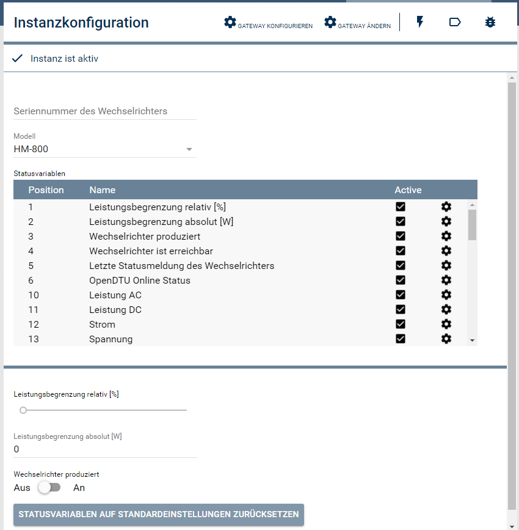

# OpenDTU
Das Modul stellt die Betriebsdaten der OpenDTU in IP-Symcon bereit. Außerdem ermöglicht es den Neustart der OpenDTU und ein Wiederverbinden der MQTT Verbindung.

### Inhaltsverzeichnis

1. [Einrichten der Instanzen in IP-Symcon](#1-einrichten-der-instanzen-in-ip-symcon)
2. [Statusvariablen und Profile](#2-statusvariablen)
3. [WebFront](#3-webfront)
4. [PHP-Befehlsreferenz](#4-php-befehlsreferenz)

### 1. Einrichten der Instanzen in IP-Symcon

__Konfigurationsseite__:

Name     | Beschreibung
-------- | ------------------
BaseTopic  | MQTT BaseTopic der OpenDTU (kann im Webinterface der OpenDTU unter *Settings->MQTT* gefunden und bei Bedarf konfiguriert werden)
Username     | OpenDTU Benutzername (Standard: admin)
Password      | OpenDTU Passwort (Standard: openDTU42)
Reconnect   | Automatisch wiederverbinden bei MQTT Verbindungsfehlern

### 2. Statusvariablen

Alle Statusvariablen können in der Instantzkonfiguration einzeln aktiviert bzw. deaktiviert werden.

### 3. WebFront

Im Webfront können keine Aktionen durchgeführt werden

### 4. PHP-Befehlsreferenz

`boolean OPENDTU_Reboot(integer $InstanzID);`

Startet die OpenDTU neu. Hierbei werden auch die Tageszähler zurückgesetzt.

`boolean HOYMILES_ReconnectMQTT(integer $InstanzID);`

Erzwingt einen Neustart der MQTT Verbindung über die WebAPI der OpenDTU . 

