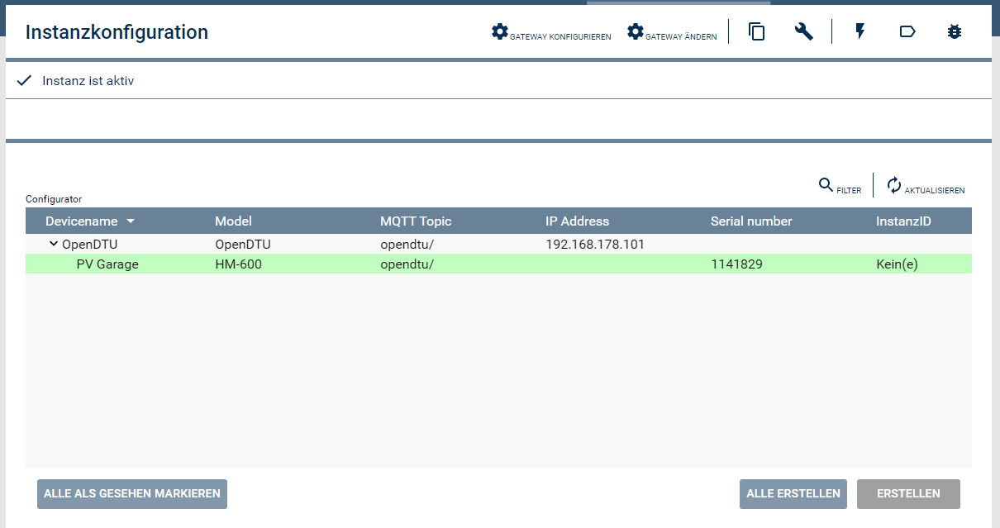

# OpenDTU Configurator
Der Konfigurator erkennt automatisch alle am IP-Symcon MQTT-Server angemeldeten OpenDTU's und ermöglicht die einfache Erstellung der Hoymiles Microinverter Instanzen ohne Konfigurationsaufwandt.

### Inhaltsverzeichnis

1. [Einrichten der Instanzen in IP-Symcon](#1-einrichten-der-instanzen-in-ip-symcon)
2. [Statusvariablen und Profile](#2-statusvariablen-und-profile)
3. [WebFront](#3-webfront)
4. [PHP-Befehlsreferenz](#4-php-befehlsreferenz)

### 1. Einrichten der Instanzen in IP-Symcon

Unter 'Instanz hinzufügen' kann das 'HoymilesOpenDTUConfigurator'-Modul mithilfe des Schnellfilters gefunden werden. 

Der Konfigurator findet automatisch alle OpenDTU's, die am IP-Symcon MQTT-Server angemeldet sind. Sofern noch keine MQTT-Server Instanz vorhanden ist, erstellt der Konfigurator eine neue Server-Instanz.

__Konfigurationsseite__:

### 2. Statusvariablen und Profile

Modul verfügt über keine Statusvariablen.

### 3. WebFront

Modul ist nicht im WebFront verfügbar.

### 4. PHP-Befehlsreferenz

Modul bietet Keine öffentlichen Funktionen.